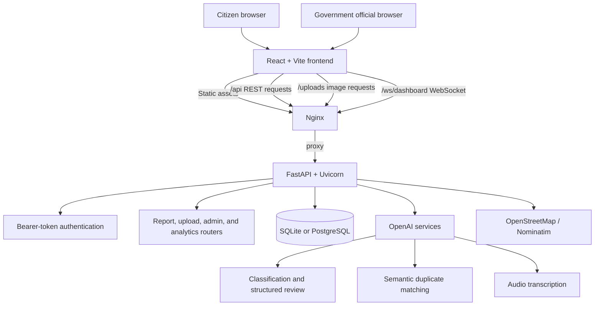
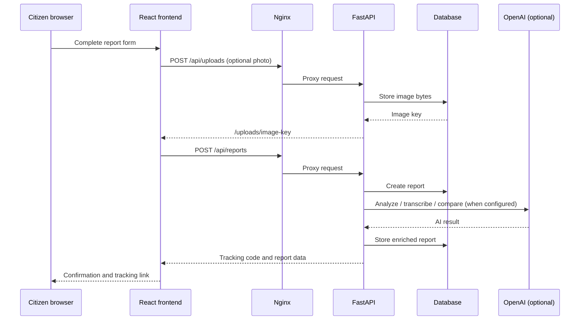

# CivicReport

CivicReport is a civic-issue reporting platform for citizens and government teams. Citizens can submit issues with location, photos, and optional voice descriptions; officials can review, triage, update, and analyze reports from a protected dashboard.

The project is designed as a single-page web application backed by a FastAPI service. It supports Bangla and English, real-time dashboard updates, AI-assisted report analysis, duplicate detection, and installable PWA behavior.

## Highlights

- Public issue submission and tracking with citizen-facing tracking codes
- Protected government dashboard for status, department, and duplicate management
- Location picking, address search, reverse geocoding, and GPS support
- JPEG, PNG, and WebP uploads with database-backed image delivery
- Optional voice transcription and AI-assisted classification
- Duplicate detection using report metadata, location, semantic similarity, and image hashes
- Real-time dashboard refresh through WebSockets
- English/Bangla UI and Bangladesh-time display formatting
- PWA app shell for installable/offline frontend access

## Technology stack

| Area | Technology | Purpose |
| --- | --- | --- |
| Frontend | React 18 | Component-based citizen and government interfaces |
| Build tooling | Vite | Fast local development and optimized production builds |
| Styling | Tailwind CSS | Utility-first responsive styling |
| Routing | React Router | Client-side public, tracking, and admin routes |
| Maps | Leaflet and React Leaflet | Interactive maps, markers, and location selection |
| Charts | Recharts | Dashboard and admin visualizations |
| Backend | FastAPI | Typed REST API, uploads, and WebSocket endpoints |
| Application server | Uvicorn | ASGI server used to run FastAPI |
| ORM and validation | SQLAlchemy and Pydantic | Data persistence, schemas, and request validation |
| Database | SQLite by default | Local/development persistence; PostgreSQL is configurable |
| AI services | OpenAI API | Structured report review, embeddings, and transcription |
| Mapping services | OpenStreetMap and Nominatim | Map tiles, geocoding, and reverse geocoding |
| Production proxy | Nginx | Serves frontend assets and proxies API, uploads, and WebSockets |
| Process management | systemd | Keeps the production FastAPI service running and starts it on boot |

## Architecture



### Request flow



### Production deployment layout

```mermaid
flowchart LR
    Internet[Internet] --> VM[Azure VM public IP]
    VM --> Nginx[Nginx :80]
    Nginx --> Static[/srv/civic/frontend/dist]
    Nginx --> API[127.0.0.1:8000]
    API --> Service[civic-api systemd service]
    Service --> App[/srv/civic/backend/app]
    Service --> Data[(civic.db or PostgreSQL)]
```

Nginx is the only public-facing service. Uvicorn listens on `127.0.0.1:8000`, so the backend is accessible through the same origin at `/api` rather than through a separate exposed port.

## Repository layout

```text
civic/
├── backend/
│   ├── app/
│   │   ├── core/          # authentication, settings, uploads, WebSocket manager
│   │   ├── models/        # SQLAlchemy models
│   │   ├── routers/       # public, admin, upload, analytics, and transcription APIs
│   │   ├── schemas/       # Pydantic request/response schemas
│   │   └── services/      # AI, duplicate, email, and image-hash services
│   ├── .env.example       # safe configuration template
│   └── requirements.txt
├── frontend/
│   ├── public/            # PWA and static files
│   └── src/
│       ├── api/           # API client and session token helpers
│       ├── components/    # shared UI components
│       ├── context/       # language state
│       ├── i18n/          # Bangla/English content and time formatting
│       └── pages/         # citizen, tracking, dashboard, and visualization pages
├── .gitignore
└── README.md
```

## Local development

### Prerequisites

- Python 3.10 or newer
- Node.js 18 or newer
- npm
- An OpenAI API key only if AI analysis or transcription is required

### Backend

```bash
cd backend
python -m venv venv

# Windows PowerShell
venv\Scripts\activate

# Linux/macOS
# source venv/bin/activate

pip install -r requirements.txt
```

Copy the environment template and add local values:

```bash
# Windows PowerShell
Copy-Item .env.example .env

# Linux/macOS
# cp .env.example .env
```

Start the API:

```bash
python -m app.seed
uvicorn app.main:app --reload
```

The API runs at `http://localhost:8000`. Interactive API documentation is available at `http://localhost:8000/docs`.

### Frontend

In a second terminal:

```bash
cd frontend
npm install
npm run dev
```

Open `http://localhost:5173`. During development, the frontend communicates with the backend through the Vite API configuration.

## Configuration

Create `backend/.env` from `backend/.env.example`. Never commit `.env`.

```env
DATABASE_URL=sqlite:///./civic.db
OPENAI_API_KEY=your-openai-api-key
GOVERNMENT_USERNAME=official
GOVERNMENT_PASSWORD=use-a-strong-unique-password
AUTH_SECRET=use-a-long-random-secret
AUTH_TOKEN_TTL_MINUTES=480
```

`DATABASE_URL` can point to SQLite for development or PostgreSQL for a multi-user production deployment. If no OpenAI key is configured, report creation remains available through the application's fallback review path.

## API routes

| Route group | Purpose |
| --- | --- |
| `/api/health` | Health probe |
| `/api/reports` | Report submission, listing, and report management |
| `/api/track/{tracking_code}` | Public tracking lookup |
| `/api/uploads` | Image upload endpoint |
| `/uploads/{file_key}` | Uploaded-image delivery |
| `/api/auth/login` | Government dashboard authentication |
| `/api/analytics` | Government reporting metrics |
| `/api/transcriptions` | Optional audio transcription |
| `/ws/dashboard` | Live dashboard update channel |

## Production deployment

1. Build the frontend with `npm run build` and copy `frontend/dist` to the server.
2. Install backend dependencies into a Linux virtual environment.
3. Create `backend/.env` directly on the server with production credentials.
4. Run Uvicorn through a `systemd` service, bound to `127.0.0.1:8000`.
5. Configure Nginx to serve the frontend build and proxy `/api/`, `/uploads/`, and `/ws/` to Uvicorn.
6. Expose Nginx on port 80, and add TLS on port 443 before production use.

Example Nginx routing model:

```nginx
location /api/     { proxy_pass http://127.0.0.1:8000; }
location /uploads/ { proxy_pass http://127.0.0.1:8000; }
location /ws/      { proxy_pass http://127.0.0.1:8000; }
location /         { try_files $uri $uri/ /index.html; }
```

## Security notes

- Do not commit API keys, passwords, `.env` files, databases, virtual environments, frontend builds, or dependency folders.
- Use a unique government password and generate `AUTH_SECRET` with a cryptographically secure random generator.
- Rotate any credential that has appeared in source code, terminal output, chat logs, or a repository.
- Use HTTPS, firewall rules, least-privilege VM access, and managed database backups for a production rollout.
- SQLite is suitable for small deployments and demos; use PostgreSQL when concurrent writes, resilience, or managed backups are important.

## License

Add a license file before distributing or accepting external contributions.
